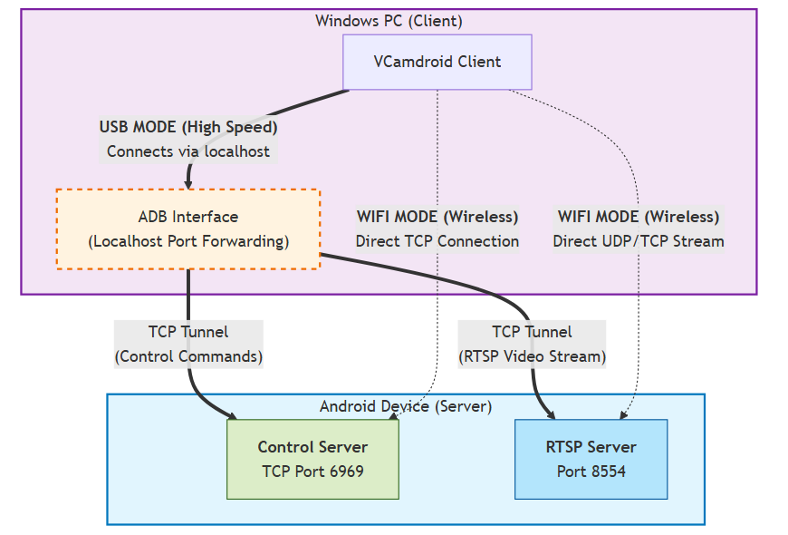
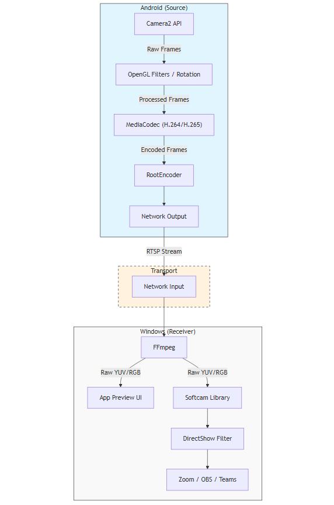

<h1 align="center">
  <sub>
    
  </sub>
  <br>
  VCamdroid
</h1>

<p align="center">Turn your Android phone into a high-performance Windows webcam.</p>

<p align="center">
  <a href="https://github.com/darusc/VCamdroid/blob/main/LICENSE">
    
  </a>
  <a href="https://github.com/darusc/VCamdroid/releases">
    
  </a>
  <a href="https://github.com/darusc/VCamdroid/releases">
    
  </a>
</p>

## Table of Contents

1. [**Description**](#description)
2. [**Key Features**](#key-features)
3. [**Installation Guide**](#installation-guide)
4. [**Usage Instructions**](#usage-instructions)
5. [**Troubleshooting**](#troubleshooting)
6. [**Reporting Issues**](#reporting-issues)
7. [**Technical Architecture**](#technical-architecture)
8. [**Contributing**](#contributing)

## Description

VCamdroid allows you to seamlessly use your mobile device’s camera as a virtual webcam on your PC. Built using a custom DirectShow filter provided by [Softcam library](https://github.com/tshino/softcam), it ensures compatibility with popular applications like Zoom, OBS, Discord, and Teams. Whether wired (via ADB) or wireless (via Wi-Fi), VCamdroid delivers a low-latency, hardware-accelerated video feed directly to your desktop.

<p align="center">
  
</p>

## Key Features

* **Universal Compatibility:** Works with any Windows application that supports standard webcams.
* **Flexible Connectivity:** Supports high-speed wired connections (via ADB) and convenient wireless connections (via Wi-Fi).
* **Multi-Device Support:** Connect multiple Android devices simultaneously and switch between them instantly.
* **Full Camera Control:** Remotely toggle between front and back cameras, adjust resolutions, and enable flash.
* **Image Adjustments:** Real-time controls for rotation, mirroring (flip), brightness, contrast, and saturation.
* **Zero-Config Pairing:** Automatically connects over USB via ADB; straightforward QR code pairing for Wi-Fi.


## Installation Guide

### Prerequisites
* **PC:** Windows 10 or 11.
* **Phone:** Android 7.0 (Nougat) or higher.

### Step 1: Install on Windows
1.  Download the latest binaries from the [**Releases Page**](https://github.com/darusc/VCamdroid/releases).
2.  Extract the ZIP archive.
3.  Right-click `install.bat` and select **Run as Administrator**.
    * *Note: This script registers `softcam.dll` with the system, making the virtual webcam device visible to other applications.*
4. Check both **Private** and **Public** profiles in the Windows Firewall popup and allow the app

### Step 2: Install on Android
You can transfer the APK file to your phone and install it manually, or follow the steps below for an automatic install:
1.  Connect your phone to your PC via USB.
2.  Ensure **USB Debugging** is enabled (see instructions below).
3.  Run `install_apk.bat` on your PC to automatically install the app on your phone.


### 💡 How to Enable USB Debugging
1.  Go to **Settings > About Phone**.
2.  Find **Build Number** and tap it **7 times** until you see "You are now a developer!"
3.  Go back to **Settings > System > Developer Options**.
4.  Toggle **USB Debugging** to **ON**.
    * *For device-specific steps, refer to the [official Android documentation](https://developer.android.com/studio/debug/dev-options).*


## Usage Instructions

### Wired Connection (USB / ADB)
*Recommended for lowest latency and highest stability.*

1.  Connect your phone to the PC via USB.
2.  Launch the **VCamdroid Desktop Client**.
3.  Launch the **VCamdroid App** on your phone.
4.  The connection is automatic. App should change to streaming mode.

### Wireless Connection (Wi-Fi)
1.  Ensure both your PC and phone are on the same Wi-Fi network.
2.  Launch the **VCamdroid Desktop Client** and select the **Connect** tab to reveal a QR Code.
3.  Launch the **VCamdroid App** on your phone.
4.  Point your camera at the PC screen to scan the QR code. Clicl 'connect' in the popup dialog.

If you encounter any problems check the [**Troubleshooting**](#troubleshooting) section. If the issue still persist, please [report the issue](#reporting-issues).


---

## Technical Architecture

### Networking Protocol
VCamdroid utilizes the industry-standard **RTSP (Real-Time Streaming Protocol)** to ensure robust, low-latency video transmission between the Android device and the Windows client.

1.  **Transport Layer:**
    * **Wi-Fi Connection:** The Windows client connects directly to the RTSP server running on the Android device over the local network.
    * **USB Connection:** To enable wired communication, the application uses **ADB Port Forwarding**. Since ADB only supports TCP forwarding, the RTSP stream is tunneled exclusively over **TCP** (interleaved RTSP). This creates a stable, high-bandwidth tunnel via `localhost` that bypasses network interference.

2.  **Stream Handling Libraries:**
    * **Server Side (Android):** Powered by the [RootEncoder](https://github.com/pedroSG94/RootEncoder) library. It handles the complex tasks of interfacing with the Android encoder, packetizing the video data into RTP packets, and managing the RTSP server session.
    * **Client Side (Windows):** Utilizes [FFmpeg](https://ffmpeg.org/), the leading multimedia framework, to robustly demux the RTSP stream and decode the incoming video packets.

<p align="center"></p> 

### Video Pipeline
The pipeline is engineered for performance, offloading image processing to the Android GPU before compression to minimize latency and bandwidth.

1.  **Capture, Process & Encode (Android):**
    * **Capture:** Video frames are captured using the modern **Camera2 API**.
    * **Pre-Processing:** Raw frames are processed on the GPU using OpenGL. Operations like **Rotation**, **Mirroring (Flip)**, and **Color Correction** are applied here *before* encoding, ensuring the stream is "ready-to-display."
    * **Hardware Encoding:** The processed frames are passed to the device's hardware **MediaCodec** (supporting **H.264** or **H.265/HEVC**). This offloads compression from the CPU.
    * **Transmission:** **RootEncoder** encapsulates the encoded stream into RTP packets and transmits them over the active network connection.

2.  **Decode & Render (Windows):**
    * **Decoding:** The Windows client receives the RTSP stream and uses **FFmpeg** to decode the compressed H.264/H.265 frames into raw image data (YUV/RGB).
    * **Output:**
        * **UI Preview:** The decoded frame is rendered immediately to the application window for live monitoring.
        * **Virtual Device:** The frame is written to a ring buffer managed by the [Softcam](https://github.com/tshino/softcam) library. Softcam acts as the bridge between the user application and the system-registered DirectShow filter, allowing third-party apps (Zoom, Teams, OBS) to treat the stream as a physical webcam device.

<p align="center"></p> 


## 🤝 Contributing

We actively welcome contributions! Whether you're fixing a bug, optimizing performance, or adding a cool new feature, please feel free to fork the repository and submit a Pull Request.

### 📂 Repository Structure
* `android/`: The Android Studio project (Kotlin). Handles Camera2 API capture, OpenGL processing, and RTSP streaming.
* `windows/`: The Visual Studio solution (C++). Contains the Desktop Client GUI and the DirectShow Filter logic.

---

### 🛠️ Development Setup

#### 📱 Android App
1.  **Prerequisites:** Install the latest **Android Studio**.
2.  **Import:** Open the `android/` directory as a project.
3.  **Build:** Let Gradle sync and download dependencies.
    * *Core Dependency:* [RootEncoder](https://github.com/pedroSG94/RootEncoder) (handles RTSP/RTP packets).
4.  **Run:** Connect a physical Android device (emulators often lack necessary encoder hardware) and run the `app` module.

#### 💻 Windows Client
1.  **Prerequisites:**
    * **Visual Studio 2026** (with "Desktop development with C++" workload).
    * **vcpkg** for ```asio 1.32.0```, ```wxWidgets 3.3.1``` and ```ffmpeg 7.1.2```.

2.  **Install Dependencies:**
    Use `vcpkg` to install the required libraries for **x64**:
    ```powershell
    vcpkg install wxwidgets:x64-windows ffmpeg:x64-windows
    vcpkg integrate install
    ```

3.  **Build Instructions:**
    * Build ```softcam```. [See](https://github.com/tshino/softcam?tab=readme-ov-file#how-to-build-the-library) for instructions.
    * Open `windows/VCamdroid.sln`.
    * Set the configuration to **Release / x64** (x86 is not supported).
    * Build the solution.

4.  **Testing the Driver:**
    * The DirectShow filter (`softcam.dll`) must be registered to be visible to apps like OBS or Zoom.
    * Run `install.bat` as Administrator in your output directory, or manually register it via:
        ```cmd
        regsvr32 softcam.dll
        ```

### 📬 Submitting a Pull Request
1.  Fork the project.
2.  Create your feature branch (`git checkout -b feature/AmazingFeature`).
3.  Commit your changes (`git commit -m 'Add some AmazingFeature'`).
4.  Push to the branch (`git push origin feature/AmazingFeature`).
5.  Open a Pull Request.


## Troubleshooting

### App Crashes / "VCRUNTIME140.dll was not found"
If the application closes immediately or you see a system popup error regarding missing DLLs (like `VCRUNTIME140.dll` or `MSVCP140.dll`), your PC is missing the C++ runtime libraries.
* **Fix:** Download and install the [latest VC++ Redistributable (x64)](https://aka.ms/vs/17/release/vc_redist.x64.exe) from Microsoft.

### Connection Failed / Host Unreachable
If the Android app cannot connect to the Windows client:
1.  **Check Windows Firewall:** The firewall often blocks incoming video streams.
    * Search for **"Allow an app through Windows Firewall"** in the Start Menu.
    * Find `VCamdroid.exe` in the list and ensure both **Private** and **Public** boxes are checked.
2.  **Verify Network Visibility (Reverse Ping Test):**
    Sometimes the phone cannot see the PC. To verify:
    * Connect via USB (for the test command).
    * Open a terminal in the VCamdroid folder and run: `adb shell ping -c 4 <PC_IP_ADDRESS>`
    * If you see "100% packet loss" or "unreachable," your PC's firewall or router settings (AP Isolation) are blocking the connection.

### USB Connection not working
If the app does not detect your phone:
1.  **Check ADB Devices:**
    * Open a terminal in the VCamdroid folder.
    * Run: `adb devices`
    * **If list is empty:** Your cable is bad or [Universal ADB Drivers](https://adb.clockworkmod.com/) are missing.
    * **If "unauthorized":** Check your phone screen and tap "Allow" on the **"Allow USB Debugging?"** popup.
2.  **Kill Conflicting ADB Processes:**
    * Open **Task Manager** (`Ctrl + Shift + Esc`).
    * Search for `adb.exe` in the **Details** tab.
    * Right-click and select **End Task**, then restart VCamdroid.

---

## Reporting Issues

VCamdroid is a new project, and hardware compatibility varies across thousands of Android devices. Your feedback is crucial!

If you encounter a bug or crash, please open a [New Issue](https://github.com/darusc/VCamdroid/issues) and **attach the logs** to help us fix it faster.

### How to get the logs:
1.  **Android Logs:**
    * Open the VCamdroid app on your phone.
    * Tap the **Bug Icon** 🐞 in the top corner.
    * Click the **Save/Share** button to export the log file.
2.  **Windows Logs:**
    * Check the `vcamdroid.log` file inside the VCamdroid installation directory.
    * Copy the text from the latest log file.

**Please include:**
* Phone Model (e.g., Samsung S21, Pixel 6)
* Android Version
* Connection Method (USB or Wi-Fi)\